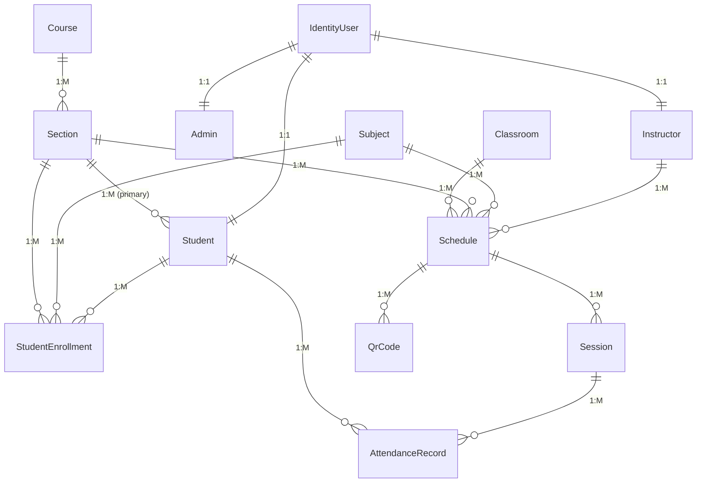

# Architecture Guide

This document provides a comprehensive overview of the Attendance Management System's architecture, design patterns, and system organization.

## System Architecture Overview

The Attendance Management System follows a **Clean Architecture** pattern with clear separation of concerns across multiple layers:

```
┌─────────────────────────────────────────────────────────────┐
│                    Presentation Layer                       │
│  ┌─────────────────┐  ┌─────────────────┐  ┌─────────────┐ │
│  │   Controllers   │  │      DTOs       │  │ Middleware  │ │
│  └─────────────────┘  └─────────────────┘  └─────────────┘ │
└─────────────────────────────────────────────────────────────┘
                                │
┌─────────────────────────────────────────────────────────────┐
│                    Business Logic Layer                     │
│  ┌─────────────────┐  ┌─────────────────┐  ┌─────────────┐ │
│  │    Services     │  │   Interfaces    │  │ Validation  │ │
│  └─────────────────┘  └─────────────────┘  └─────────────┘ │
└─────────────────────────────────────────────────────────────┘
                                │
┌─────────────────────────────────────────────────────────────┐
│                    Data Access Layer                        │
│  ┌─────────────────┐  ┌─────────────────┐  ┌─────────────┐ │
│  │  Repositories   │  │    DbContext    │  │  Entities   │ │
│  └─────────────────┘  └─────────────────┘  └─────────────┘ │
└─────────────────────────────────────────────────────────────┘
                                │
┌─────────────────────────────────────────────────────────────┐
│                    Infrastructure Layer                     │
│  ┌─────────────────┐  ┌─────────────────┐  ┌─────────────┐ │
│  │   Database      │  │   External      │  │   Logging   │ │
│  │  (SQL Server)   │  │    Services     │  │             │ │
│  └─────────────────┘  └─────────────────┘  └─────────────┘ │
└─────────────────────────────────────────────────────────────┘
```

## Layer Responsibilities

### 1. Presentation Layer
**Location**: `/Controllers`, `/Models/DTO`

**Responsibilities**:
- Handle HTTP requests and responses
- Input validation and model binding
- Authentication and authorization
- Response formatting and error handling

**Key Components**:
- **Controllers**: API endpoints (AccountController, StudentController, etc.)
- **DTOs**: Data transfer objects for requests and responses
- **Middleware**: Cross-cutting concerns (authentication, logging, error handling)

### 2. Business Logic Layer
**Location**: `/Services`, `/IServices`

**Responsibilities**:
- Implement business rules and domain logic
- Coordinate between presentation and data layers
- Handle complex operations and workflows
- Enforce business constraints

**Key Components**:
- **Services**: Business logic implementation
- **Interfaces**: Service contracts and abstractions
- **Validation**: Business rule validation

### 3. Data Access Layer
**Location**: `/Repositories`, `/IRepository`, `/Data`

**Responsibilities**:
- Data persistence and retrieval
- Query optimization and data mapping
- Transaction management
- Database schema management

**Key Components**:
- **Repositories**: Data access patterns
- **DbContext**: Entity Framework context
- **Entities**: Domain models and database entities

### 4. Infrastructure Layer
**Location**: External dependencies and configuration

**Responsibilities**:
- Database connectivity
- External service integration
- Logging and monitoring
- Configuration management

## Design Patterns

### 1. Repository Pattern
Abstracts data access logic and provides a uniform interface for data operations.

```csharp
public interface IStudentRepository : IBaseRepository<Student>
{
    Task<Student?> GetStudentByUserIdAsync(string userId);
    Task<IEnumerable<Student>> GetActiveStudentsAsync();
    Task<bool> SoftDeleteAsync(int id);
    Task<bool> RestoreAsync(int id);
}
```

**Benefits**:
- Testability through dependency injection
- Separation of concerns
- Consistent data access patterns

### 2. Service Layer Pattern
Encapsulates business logic and coordinates between controllers and repositories.

```csharp
public interface IStudentService
{
    Task<Student> GetStudentByIdAsync(int id);
    Task<Student> CreateStudentAsync(CreateStudent createStudent, ClaimsPrincipal user);
    Task<Student> UpdateStudentAsync(int id, UpdateStudent updateStudent, ClaimsPrincipal user);
    Task SoftDeleteStudentAsync(int id, ClaimsPrincipal user);
}
```

**Benefits**:
- Business logic centralization
- Transaction management
- Complex operation coordination
- Exception-based error handling for cleaner code

### 3. Dependency Injection Pattern
Used throughout the application for loose coupling and testability.

```csharp
// Service registration in Program.cs
builder.Services.AddScoped<IStudentService, StudentService>();
builder.Services.AddScoped<IStudentRepository, StudentRepository>();

// Constructor injection in controllers
public StudentController(IStudentService studentService, ILogger<StudentController> logger)
{
    _studentService = studentService;
    _logger = logger;
}
```

### 4. Factory Pattern
Used for creating complex objects with specific configurations.

```csharp
public interface IUserFactory
{
    Task<IdentityUser> CreateUserAsync(RegisterDto registerDto);
}
```

### 5. Adapter Pattern for Authentication
Implemented for different client types (mobile/web) with different token delivery mechanisms.

```csharp
// JWT tokens for mobile/API clients
[HttpPost("login")]
public async Task<ActionResult<LoginResponseDto>> Login(LoginDto loginDto)

// HTTP-only cookies for web clients
[HttpPost("web/login")]
public async Task<ActionResult<WebLoginResponseDto>> WebLogin(WebLoginDto webLoginDto)
```

**Authentication Approaches**:
- **JWT Token Strategy**: Returns tokens in response body for mobile/API clients
- **Cookie Strategy**: Sets HTTP-only cookies for web browser clients
- **Shared Logic**: Both endpoints use the same `LoginAsync` service method
- **Security**: HTTP-only cookies prevent XSS attacks for web clients

## Domain Model

### Core Entities

#### User Management
- **IdentityUser**: ASP.NET Core Identity user
- **Student**: Student-specific information
- **Instructor**: Instructor-specific information
- **Admin**: Administrator-specific information

#### Academic Structure
- **Course**: Academic programs (e.g., Computer Science)
- **Section**: Class sections within courses
- **Subject**: Individual subjects/courses
- **Schedule**: Class schedules linking subjects, sections, instructors, and classrooms

#### Attendance System
- **Session**: Attendance sessions for scheduled classes
- **AttendanceRecord**: Individual student attendance records
- **QrCode**: QR codes for attendance tracking

#### Infrastructure
- **Classroom**: Physical classroom information
- **RefreshToken**: JWT refresh token management
- **BlacklistedToken**: Revoked token tracking
- **StudentEnrollment**: Student enrollment in subjects (for irregular students)

### Entity Relationships



## Authentication & Authorization

### Authentication Flow

1. **Registration**: User registers with role-specific information
2. **Login**: Credentials validated, JWT tokens issued
3. **Token Usage**: Access token included in requests
4. **Token Refresh**: Refresh token used to get new access token
5. **Logout**: Tokens blacklisted and invalidated

### Authorization Levels

- **Public**: Health check, registration
- **Authenticated**: Profile access, basic operations
- **Role-based**:
  - **Student**: View own attendance, subjects
  - **Teacher**: Manage assigned classes, generate QR codes
  - **Admin**: Full system access

### Security Features

- **JWT Tokens**: Stateless authentication
- **Refresh Tokens**: Secure token renewal
- **Token Blacklisting**: Immediate token revocation
- **HTTP-Only Cookies**: XSS protection for web clients
- **Password Hashing**: ASP.NET Core Identity
- **Rate Limiting**: Prevent abuse
- **CORS**: Cross-origin request control

## Data Flow Patterns

### Request Processing Flow

```
HTTP Request → Middleware → Controller → Service → Repository → Database
                    ↓           ↓          ↓          ↓
                Logging    Validation  Business   Data Access
                Auth       DTOs        Logic      Queries
                CORS       Mapping     Rules      Transactions
```

### Error Handling Flow

```
Exception → Global Handler → Error Response → Client
    ↓              ↓              ↓
  Logging    Error Mapping   Consistent Format
  Metrics    Status Codes    User-Friendly
```

## Performance Considerations

### Database Optimization

1. **Indexing Strategy**:
   - Primary keys (clustered indexes)
   - Foreign keys for join optimization
   - Unique constraints for data integrity
   - Composite indexes for complex queries

2. **Query Optimization**:
   - Eager loading for related data
   - AsNoTracking for read-only queries
   - Pagination for large datasets
   - Projection for minimal data transfer

3. **Connection Management**:
   - Connection pooling
   - Async/await patterns
   - Proper disposal of resources

### Caching Strategy

- **In-Memory Caching**: Frequently accessed reference data
- **Response Caching**: Static or semi-static endpoints
- **Database Query Caching**: EF Core query caching

### Scalability Patterns

- **Stateless Design**: Horizontal scaling capability
- **Async Operations**: Non-blocking I/O
- **Background Services**: Offload heavy operations
- **Load Balancing Ready**: No session state dependencies

## Testing Architecture

### Test Structure

```
attendance.testproject/
├── Controllers_Testing/     # Controller unit tests
├── Services_Testing/        # Service layer tests
├── Integration_Testing/     # End-to-end tests
└── Mocks/                  # Test doubles and fixtures
```

### Testing Patterns

1. **Unit Tests**: Individual component testing
2. **Integration Tests**: Multi-component interaction
3. **Mocking**: External dependency isolation
4. **Test Fixtures**: Reusable test data setup

## Configuration Management

### Environment-Based Configuration

- **Development**: Local development settings
- **Staging**: Pre-production testing
- **Production**: Live environment settings

### Configuration Sources

1. **appsettings.json**: Base configuration
2. **appsettings.{Environment}.json**: Environment-specific
3. **Environment Variables**: Sensitive data
4. **.env Files**: Local development secrets

### Security Configuration

- **JWT Settings**: Token configuration
- **Database Connections**: Encrypted connection strings
- **CORS Policies**: Origin restrictions
- **Rate Limiting**: Request throttling

## Deployment Architecture

### Container Strategy

```dockerfile
# Multi-stage build for optimization
FROM mcr.microsoft.com/dotnet/sdk:10.0 AS build
# Build application

FROM mcr.microsoft.com/dotnet/aspnet:10.0 AS runtime
# Runtime environment
```

### Infrastructure Components

- **Application Server**: ASP.NET Core runtime
- **Database Server**: SQL Server
- **Reverse Proxy**: Nginx/IIS (production)
- **Load Balancer**: For horizontal scaling

### Monitoring & Observability

- **Structured Logging**: JSON-formatted logs
- **Health Checks**: Application and database health
- **Metrics Collection**: Performance monitoring
- **Error Tracking**: Exception monitoring

## Extension Points

### Adding New Features

1. **New Entity**: Create entity, repository, service, controller
2. **New Business Logic**: Extend service layer
3. **New Endpoints**: Add controller actions
4. **New Validation**: Custom validation attributes

### Customization Areas

- **Authentication Providers**: OAuth, SAML integration
- **Notification Systems**: Email, SMS, push notifications
- **Reporting**: Custom report generation
- **Integration**: External system connectivity

This architecture provides a solid foundation for maintainability, testability, and scalability while following established patterns and best practices.
