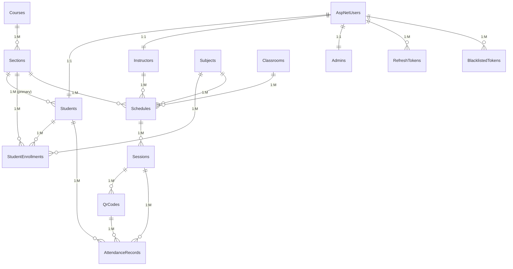

# Database Schema Documentation

This document provides a comprehensive overview of the database schema for the Attendance Management System, including entity relationships, constraints, and data flow patterns.

## Database Overview

The system uses **SQL Server** with **Entity Framework Core** as the ORM. The database follows a normalized design pattern with proper foreign key relationships and indexing strategies.

### Key Design Principles

- **Normalization**: Follows 3NF to eliminate data redundancy
- **Referential Integrity**: Proper foreign key constraints
- **Soft Deletes**: Preserves data integrity for auditing
- **Indexing**: Optimized for common query patterns
- **Audit Trail**: CreatedAt/UpdatedAt timestamps on all entities

## Entity Relationship Diagram

## Core Entities

### Identity Management

#### AspNetUsers (ASP.NET Core Identity)
Built-in Identity table for user authentication.

| Column | Type | Constraints | Description |
|--------|------|-------------|-------------|
| Id | nvarchar(450) | PK | Unique user identifier |
| UserName | nvarchar(256) | Unique | Login username |
| Email | nvarchar(256) | Unique | User email address |
| PasswordHash | nvarchar(max) | | Hashed password |
| SecurityStamp | nvarchar(max) | | Security token |
| ConcurrencyStamp | nvarchar(max) | | Concurrency control |
| PhoneNumber | nvarchar(max) | | Optional phone number |
| EmailConfirmed | bit | | Email verification status |
| PhoneNumberConfirmed | bit | | Phone verification status |
| TwoFactorEnabled | bit | | 2FA status |
| LockoutEnd | datetimeoffset(7) | | Account lockout end time |
| LockoutEnabled | bit | | Lockout capability |
| AccessFailedCount | int | | Failed login attempts |

#### Students
Student-specific information linked to Identity users.

| Column | Type | Constraints | Description |
|--------|------|-------------|-------------|
| Id | int | PK, Identity | Primary key |
| Firstname | nvarchar(max) | | Student first name |
| Lastname | nvarchar(max) | | Student last name |
| IsRegular | bit | NOT NULL | Regular vs irregular student |
| UserId | nvarchar(450) | FK, Unique | Link to AspNetUsers |
| SectionId | int | FK | Primary section assignment |
| CreatedAt | datetime2(7) | NOT NULL | Record creation time |
| UpdatedAt | datetime2(7) | NOT NULL | Last update time |
| IsDeleted | bit | NOT NULL, Default(0) | Soft delete flag |
| DeletedAt | datetime2(7) | | Soft delete timestamp |

**Indexes:**
- `IX_Students_UserId` (Unique)
- `IX_Students_IsDeleted`

#### Instructors
Instructor-specific information linked to Identity users.

| Column | Type | Constraints | Description |
|--------|------|-------------|-------------|
| Id | int | PK, Identity | Primary key |
| Firstname | nvarchar(max) | | Instructor first name |
| Lastname | nvarchar(max) | | Instructor last name |
| UserId | nvarchar(450) | FK, Unique | Link to AspNetUsers |
| CreatedAt | datetime2(7) | NOT NULL | Record creation time |
| UpdatedAt | datetime2(7) | NOT NULL | Last update time |
| IsDeleted | bit | NOT NULL, Default(0) | Soft delete flag |
| DeletedAt | datetime2(7) | | Soft delete timestamp |

**Indexes:**
- `IX_Instructors_UserId` (Unique)

#### Admins
Administrator-specific information linked to Identity users.

| Column | Type | Constraints | Description |
|--------|------|-------------|-------------|
| Id | int | PK, Identity | Primary key |
| Firstname | nvarchar(max) | | Admin first name |
| Lastname | nvarchar(max) | | Admin last name |
| UserId | nvarchar(450) | FK, Unique | Link to AspNetUsers |
| CreatedAt | datetime2(7) | NOT NULL | Record creation time |
| UpdatedAt | datetime2(7) | NOT NULL | Last update time |

### Academic Structure

#### Courses
Academic programs or degree courses.

| Column | Type | Constraints | Description |
|--------|------|-------------|-------------|
| Id | int | PK, Identity | Primary key |
| Name | nvarchar(100) | NOT NULL, Unique | Course name |
| CreatedAt | datetime2(7) | NOT NULL | Record creation time |
| UpdatedAt | datetime2(7) | NOT NULL | Last update time |

**Indexes:**
- `IX_Courses_Name` (Unique)

#### Sections
Class sections within courses.

| Column | Type | Constraints | Description |
|--------|------|-------------|-------------|
| Id | int | PK, Identity | Primary key |
| Name | nvarchar(100) | NOT NULL, Unique | Section name |
| CourseId | int | FK, NOT NULL | Parent course |
| CreatedAt | datetime2(7) | NOT NULL | Record creation time |
| UpdatedAt | datetime2(7) | NOT NULL | Last update time |

**Indexes:**
- `IX_Sections_Name` (Unique)
- `IX_Sections_CourseId`

#### Subjects
Individual subjects/courses within the curriculum.

| Column | Type | Constraints | Description |
|--------|------|-------------|-------------|
| Id | int | PK, Identity | Primary key |
| Name | nvarchar(100) | NOT NULL, Unique | Subject name |
| Code | nvarchar(20) | | Subject code |
| Description | nvarchar(500) | | Subject description |
| Units | int | | Credit units |
| CreatedAt | datetime2(7) | NOT NULL | Record creation time |
| UpdatedAt | datetime2(7) | NOT NULL | Last update time |

**Indexes:**
- `IX_Subjects_Name` (Unique)

#### Classrooms
Physical classroom information.

| Column | Type | Constraints | Description |
|--------|------|-------------|-------------|
| Id | int | PK, Identity | Primary key |
| Name | nvarchar(100) | NOT NULL, Unique | Room name/number |
| Building | nvarchar(100) | | Building name |
| Capacity | int | | Room capacity |
| HasProjector | bit | | Projector availability |
| HasWhiteboard | bit | | Whiteboard availability |
| CreatedAt | datetime2(7) | NOT NULL | Record creation time |
| UpdatedAt | datetime2(7) | NOT NULL | Last update time |

**Indexes:**
- `IX_Classrooms_Name` (Unique)

### Scheduling System

#### Schedules
Recurring class schedules linking subjects, sections, instructors, and classrooms.

| Column | Type | Constraints | Description |
|--------|------|-------------|-------------|
| Id | int | PK, Identity | Primary key |
| TimeIn | time(7) | NOT NULL | Class start time |
| TimeOut | time(7) | NOT NULL | Class end time |
| DayOfWeek | nvarchar(20) | NOT NULL | Day of the week |
| SubjectId | int | FK, NOT NULL | Subject being taught |
| ClassroomId | int | FK, NOT NULL | Assigned classroom |
| SectionId | int | FK, NOT NULL | Section attending |
| InstructorId | int | FK, NOT NULL | Teaching instructor |
| CreatedAt | datetime2(7) | NOT NULL | Record creation time |
| UpdatedAt | datetime2(7) | NOT NULL | Last update time |

**Indexes:**
- `IX_Schedules_ClassroomId`
- `IX_Schedules_DayOfWeek`
- `IX_Schedules_TimeIn`
- `IX_Schedules_TimeOut`
- `IX_Schedules_TimeIn_TimeOut` (Unique)

### Attendance System

#### Sessions
Actual class session instances (occurrences of recurring schedules).

| Column | Type | Constraints | Description |
|--------|------|-------------|-------------|
| Id | int | PK, Identity | Primary key |
| ScheduleId | int | FK, NOT NULL | Parent schedule |
| Status | nvarchar(20) | NOT NULL | Session status |
| SessionDate | date | NOT NULL | Session date |
| ActualStartTime | datetime2(7) | | Actual start time |
| ActualEndTime | datetime2(7) | | Actual end time |
| AttendanceCutOff | datetime2(7) | | Late cutoff time |
| Description | nvarchar(500) | | Session notes |
| ActualRoomId | int | FK | Actual room used |
| StartedBy | int | FK | Instructor who started |
| EndedBy | int | FK | Instructor who ended |
| CreatedAt | datetime2(7) | NOT NULL | Record creation time |
| UpdatedAt | datetime2(7) | NOT NULL | Last update time |

**Indexes:**
- `IX_Sessions_ScheduleId`
- `IX_Sessions_SessionDate`
- `IX_Sessions_Status`
- `IX_Sessions_ScheduleId_SessionDate`

#### AttendanceRecords
Individual student attendance records for sessions.

| Column | Type | Constraints | Description |
|--------|------|-------------|-------------|
| Id | int | PK, Identity | Primary key |
| StudentId | int | FK, NOT NULL | Student who attended |
| SessionId | int | FK, NOT NULL | Session attended |
| QrCodeId | int | FK | QR code scanned (if any) |
| CheckInTime | datetime2(7) | NOT NULL | Check-in timestamp |
| Status | nvarchar(20) | NOT NULL | Attendance status |
| Notes | nvarchar(500) | | Additional notes |
| IsManualEntry | bit | NOT NULL | Manual vs QR entry |
| EnteredBy | nvarchar(256) | | Who entered (if manual) |
| CreatedAt | datetime2(7) | NOT NULL | Record creation time |
| UpdatedAt | datetime2(7) | NOT NULL | Last update time |

**Indexes:**
- `IX_AttendanceRecords_StudentId`
- `IX_AttendanceRecords_SessionId`
- `IX_AttendanceRecords_CheckInTime`
- `IX_AttendanceRecords_Status`

#### QrCodes
QR codes generated for attendance tracking.

| Column | Type | Constraints | Description |
|--------|------|-------------|-------------|
| Id | int | PK, Identity | Primary key |
| SessionId | int | FK, NOT NULL | Associated session |
| QrHash | nvarchar(255) | NOT NULL, Unique | Unique QR hash |
| GeneratedAt | datetime2(7) | NOT NULL | Generation time |
| ExpiresAt | datetime2(7) | NOT NULL | Expiration time |
| MaxUsage | int | | Usage limit |
| IsActive | bit | NOT NULL | Active status |
| UsageCount | int | NOT NULL | Times scanned |
| RevokedAt | datetime2(7) | | Revocation time |
| RevokedBy | nvarchar(256) | | Who revoked |
| RevocationReason | nvarchar(500) | | Revocation reason |
| CreatedAt | datetime2(7) | NOT NULL | Record creation time |
| UpdatedAt | datetime2(7) | NOT NULL | Last update time |

**Indexes:**
- `IX_QrCodes_SessionId`
- `IX_QrCodes_QrHash` (Unique)
- `IX_QrCodes_IsActive`
- `IX_QrCodes_ExpiresAt`

### Enrollment System

#### StudentEnrollments
Additional subject enrollments for irregular students.

| Column | Type | Constraints | Description |
|--------|------|-------------|-------------|
| Id | int | PK, Identity | Primary key |
| StudentId | int | FK, NOT NULL | Enrolled student |
| SectionId | int | FK, NOT NULL | Section enrolled in |
| SubjectId | int | FK, NOT NULL | Subject enrolled in |
| IsActive | bit | NOT NULL | Enrollment status |
| EnrollmentType | nvarchar(20) | NOT NULL | Type of enrollment |
| AcademicYear | nvarchar(10) | | Academic year |
| Semester | nvarchar(20) | | Semester |
| EnrolledAt | datetime2(7) | NOT NULL | Enrollment date |
| DroppedAt | datetime2(7) | | Drop date |
| CreatedAt | datetime2(7) | NOT NULL | Record creation time |
| UpdatedAt | datetime2(7) | NOT NULL | Last update time |

**Indexes:**
- `IX_StudentEnrollments_StudentId_SectionId_SubjectId` (Unique)
- `IX_StudentEnrollments_StudentId`
- `IX_StudentEnrollments_SectionId`
- `IX_StudentEnrollments_SubjectId`
- `IX_StudentEnrollments_IsActive`

### Security & Token Management

#### RefreshTokens
JWT refresh token management.

| Column | Type | Constraints | Description |
|--------|------|-------------|-------------|
| Id | int | PK, Identity | Primary key |
| TokenHash | nvarchar(max) | NOT NULL, Unique | Hashed token |
| UserId | nvarchar(450) | FK, NOT NULL | Token owner |
| ExpiresAt | datetime2(7) | NOT NULL | Expiration time |
| IsRevoked | bit | NOT NULL | Revocation status |
| CreatedAt | datetime2(7) | NOT NULL | Creation time |
| RevokedAt | datetime2(7) | | Revocation time |

**Indexes:**
- `IX_RefreshTokens_TokenHash` (Unique)
- `IX_RefreshTokens_UserId_ExpiresAt_IsRevoked`

#### BlacklistedTokens
Revoked JWT access tokens.

| Column | Type | Constraints | Description |
|--------|------|-------------|-------------|
| Id | int | PK, Identity | Primary key |
| TokenHash | nvarchar(max) | NOT NULL | Hashed token |
| UserId | nvarchar(450) | FK, NOT NULL | Token owner |
| ExpiresAt | datetime2(7) | NOT NULL | Original expiration |
| BlacklistedAt | datetime2(7) | NOT NULL | Blacklist time |

**Indexes:**
- `IX_BlacklistedTokens_TokenHash`
- `IX_BlacklistedTokens_ExpiresAt`

## Relationship Details

### One-to-One Relationships

#### User Identity Relationships
- **AspNetUsers ↔ Students**: Each user can be linked to one student profile
- **AspNetUsers ↔ Instructors**: Each user can be linked to one instructor profile
- **AspNetUsers ↔ Admins**: Each user can be linked to one admin profile

### One-to-Many Relationships

#### Academic Hierarchy
- **Courses → Sections**: One course can have multiple sections
- **Sections → Students**: One section can have multiple students (primary enrollment)

#### Scheduling
- **Instructors → Schedules**: One instructor can teach multiple scheduled classes
- **Subjects → Schedules**: One subject can be scheduled multiple times
- **Sections → Schedules**: One section can have multiple scheduled subjects
- **Classrooms → Schedules**: One classroom can host multiple scheduled classes

#### Session Management
- **Schedules → Sessions**: One schedule can have multiple session instances
- **Sessions → QrCodes**: One session can have multiple QR codes generated
- **Sessions → AttendanceRecords**: One session can have multiple attendance records

#### Attendance Tracking
- **Students → AttendanceRecords**: One student can have multiple attendance records
- **QrCodes → AttendanceRecords**: One QR code can be used for multiple attendance records

### Many-to-Many Relationships

#### Student Enrollment (via StudentEnrollments)
- **Students ↔ Subjects**: Students can enroll in multiple subjects, subjects can have multiple students
- **Students ↔ Sections**: Students can be enrolled in multiple sections (irregular students)

## Data Flow Patterns

### User Registration Flow
1. User registers via API → **AspNetUsers** created
2. Role-specific profile created → **Students/Instructors/Admins** created
3. Foreign key relationship established via **UserId**

### Attendance Tracking Flow
1. Instructor starts session → **Sessions** record created
2. QR code generated → **QrCodes** record created
3. Student scans QR → **AttendanceRecords** record created
4. Links: Student → AttendanceRecord → Session → Schedule

### Academic Structure Flow
1. Course created → **Courses** record
2. Sections created under course → **Sections** records
3. Students assigned to sections → **Students.SectionId** updated
4. Subjects scheduled for sections → **Schedules** records created

## Constraints and Business Rules

### Data Integrity Constraints

#### Unique Constraints
- **AspNetUsers.UserName**: Unique usernames
- **AspNetUsers.Email**: Unique email addresses
- **Students.UserId**: One student per user
- **Instructors.UserId**: One instructor per user
- **Courses.Name**: Unique course names
- **Sections.Name**: Unique section names
- **Subjects.Name**: Unique subject names
- **Classrooms.Name**: Unique classroom names
- **QrCodes.QrHash**: Unique QR code hashes
- **RefreshTokens.TokenHash**: Unique refresh tokens
- **StudentEnrollments**: Unique student-section-subject combinations

#### Foreign Key Constraints
- **Students.UserId** → **AspNetUsers.Id**
- **Students.SectionId** → **Sections.Id**
- **Instructors.UserId** → **AspNetUsers.Id**
- **Sections.CourseId** → **Courses.Id**
- **Schedules.SubjectId** → **Subjects.Id**
- **Schedules.SectionId** → **Sections.Id**
- **Schedules.InstructorId** → **Instructors.Id**
- **Schedules.ClassroomId** → **Classrooms.Id**
- **Sessions.ScheduleId** → **Schedules.Id**
- **AttendanceRecords.StudentId** → **Students.Id**
- **AttendanceRecords.SessionId** → **Sessions.Id**
- **QrCodes.SessionId** → **Sessions.Id**

### Business Logic Constraints

#### Soft Delete Rules
- **Students** and **Instructors** support soft deletion
- Soft deleted records are excluded from normal queries
- Soft deleted records can be restored
- Hard delete permanently removes records

#### Attendance Rules
- Students can only attend sessions for their enrolled subjects
- QR codes expire after a configurable time period
- Attendance status determined by check-in time vs session start time
- Late threshold configurable per session

#### Token Security Rules
- Refresh tokens have expiration dates
- Blacklisted tokens cannot be used
- Token cleanup removes expired entries
- One active refresh token per user session

## Performance Optimization

### Indexing Strategy

#### Primary Indexes
- All primary keys have clustered indexes
- Foreign keys have non-clustered indexes
- Unique constraints have unique indexes

#### Query Optimization Indexes
- **Students.IsDeleted**: Fast filtering of active students
- **Sessions.Status**: Quick session status queries
- **AttendanceRecords.CheckInTime**: Time-based attendance queries
- **QrCodes.ExpiresAt**: Expired QR code cleanup
- **RefreshTokens.ExpiresAt**: Token cleanup queries

#### Composite Indexes
- **Sessions(ScheduleId, SessionDate)**: Session lookup by schedule and date
- **RefreshTokens(UserId, ExpiresAt, IsRevoked)**: User token validation
- **StudentEnrollments(StudentId, SectionId, SubjectId)**: Enrollment uniqueness

### Query Patterns

#### Common Query Optimizations
- **Eager Loading**: Include related entities in single queries
- **AsNoTracking**: Read-only queries for better performance
- **Projection**: Select only required columns
- **Pagination**: Limit result sets for large tables

#### Bulk Operations
- **Batch Inserts**: Multiple attendance records
- **Bulk Updates**: Session status changes
- **Cleanup Operations**: Expired token removal

## Migration History

The database schema has evolved through multiple migrations:

1. **InitialCreateWithIntId**: Base schema with integer IDs
2. **UpdatedModels**: Model refinements
3. **UpdateStudentTableWithUserIdReference**: User identity integration
4. **InstructorModelsAddition**: Instructor entity addition
5. **RefreshTokens**: Token management system
6. **AddSectionNavigationToCourseAndInstructor**: Navigation properties
7. **AddAdminClassroomCourseScheduleSubject**: Core academic entities
8. **AddUniqueConstraintsForEntities**: Data integrity constraints
9. **AddSoftDeleteToInstructorAndStudent**: Soft delete capability
10. **AddBlacklistedTokensTable**: Token blacklisting
11. **TokenIndexes**: Performance optimization
12. **AddStudentEnrollmentSystem**: Irregular student support
13. **AddSessionAndAttendanceEntities**: Attendance tracking system
14. **RemoveRedundantEmailFields**: Data normalization

## Backup and Recovery

### Backup Strategy
- **Full Backups**: Weekly complete database backups
- **Differential Backups**: Daily incremental backups
- **Transaction Log Backups**: Hourly for point-in-time recovery

### Recovery Considerations
- **Soft Deletes**: Enable data recovery without backups
- **Audit Trails**: CreatedAt/UpdatedAt for change tracking
- **Foreign Key Constraints**: Maintain referential integrity during recovery

This schema provides a robust foundation for the attendance management system with proper normalization, indexing, and constraint management.