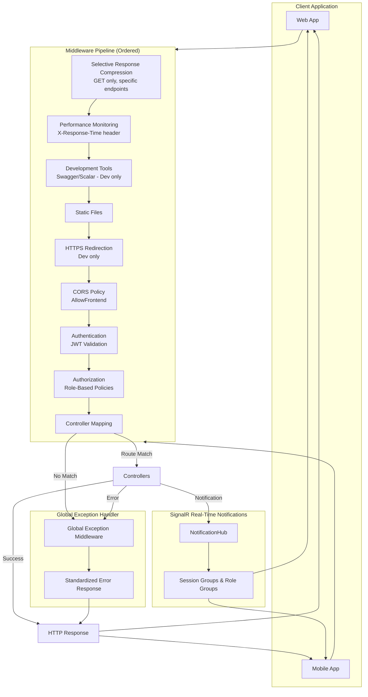
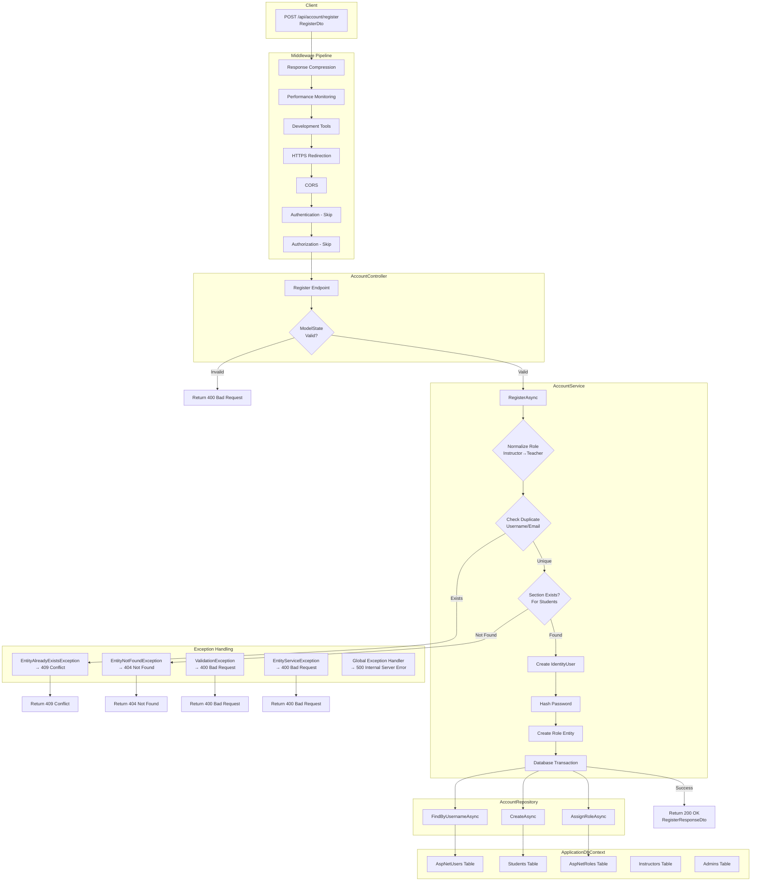
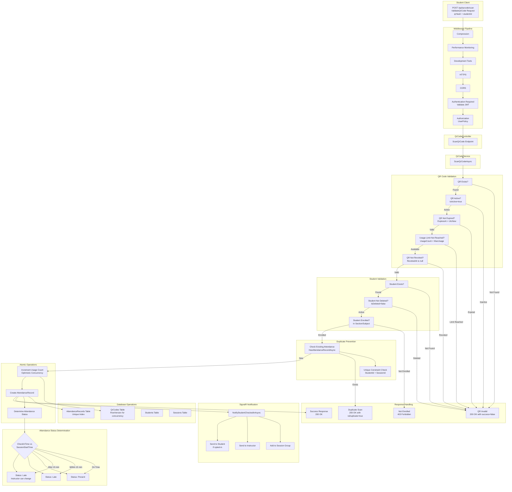
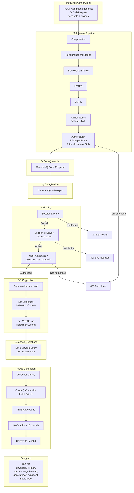
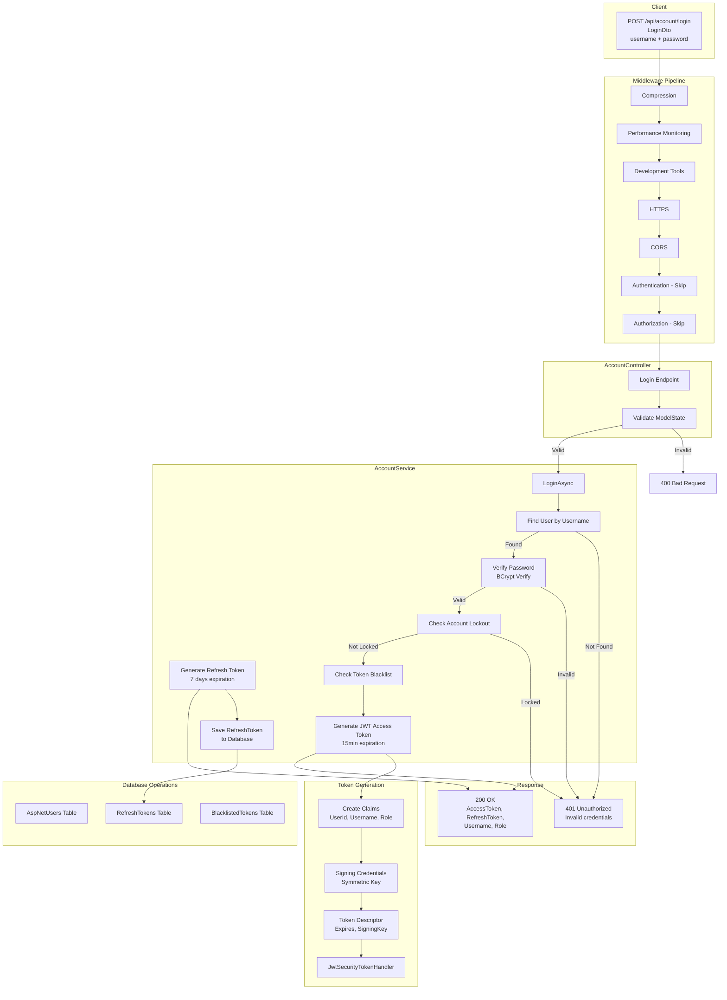
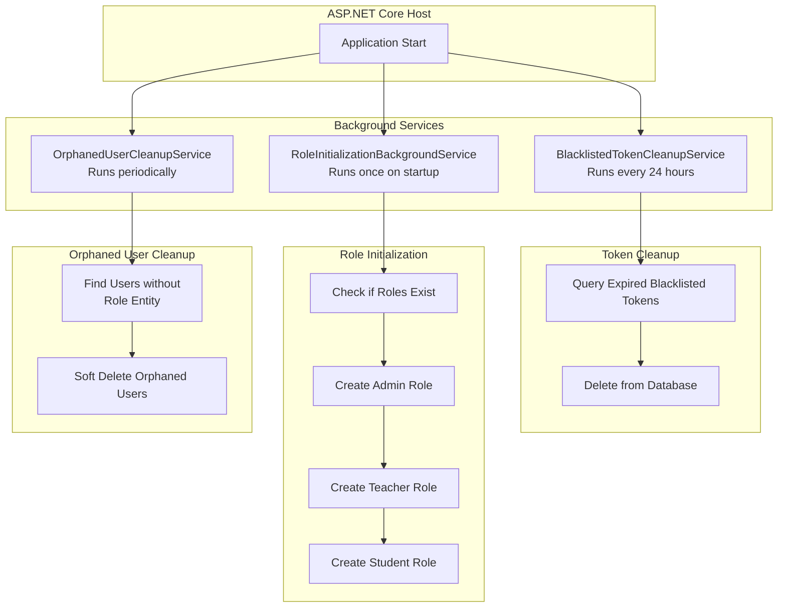

# Attendance Management Backend - Complex Data Flow Chart

## Detailed Architecture with All Layers, Middleware, Error Handling, and Background Services

---

## Complete Request Pipeline Flow



---

## 1. Complete Registration Flow with Error Handling



---

## 2. Complete QR Code Scan Flow (Attendance Recording)



---

## 3. QR Code Generation Flow (Instructor/Admin)



---

## 4. Login Flow with Token Management



---

## 5. Background Services Flow



---

## Authorization Policy Flow

```mermaid
flowchart TD
    subgraph Policies["Authorization Policies"]
        P1[AdminPolicy<br/>Role: Admin]
        P2[PrivilegedPolicy<br/>Role: Admin OR Teacher]
        P3[UserPolicy<br/>Authenticated Users]
    end

    subgraph Endpoints["Protected Endpoints"]
        E1[POST /api/qrcode/generate<br/>PrivilegedPolicy]
        E2[POST /api/attendance<br/>PrivilegedPolicy]
        E3[GET /api/students<br/>PrivilegedPolicy]
        E4[PATCH /api/account/admin/users/{id}<br/>AdminPolicy]
        E5[GET /api/students/my-subjects<br/>UserPolicy]
        E6[POST /api/qrcode/scan<br/>Authorized]
    end

    P1 --> E4
    P2 --> E1
    P2 --> E2
    P2 --> E3
    P3 --> E5
    Auth --> E6
```

---

## Database Schema Relationships

```mermaid
erDiagram
    Student ||--o{ AttendanceRecord : "has"
    Instructor ||--o{ Schedule : "teaches"
    Schedule ||--o{ Session : "defines"
    Session ||--o{ QrCode : "uses"
    Session ||--o{ AttendanceRecord : "records"
    QrCode ||--o{ AttendanceRecord : "creates"
    Section ||--o{ StudentEnrollment : "contains"
    Subject ||--o{ StudentEnrollment : "offers"
    Student ||--o{ StudentEnrollment : "enrolled in"
    Student ||--|| IdentityUser : "linked to"
    Instructor ||--|| IdentityUser : "linked to"
    Admin ||--|| IdentityUser : "linked to"
    Course ||--o{ Subject : "contains"
    Section ||--o{ Schedule : "has"
    Classroom ||--o{ Session : "hosts"

    Student {
        int Id PK
        string UserId FK
        string FirstName
        string LastName
        string StudentNumber
        bool IsDeleted
    }

    AttendanceRecord {
        int Id PK
        int StudentId FK
        int SessionId FK
        int? QrCodeId FK
        DateTime CheckInTime
        string Status
        bool IsManualEntry
    }

    QrCode {
        int Id PK
        int SessionId FK
        string QrHash UK
        DateTime GeneratedAt
        DateTime ExpiresAt
        int MaxUsage
        int UsageCount
        bool IsActive
        byte[] RowVersion
    }

    Session {
        int Id PK
        int ScheduleId FK
        int? ActualRoomId FK
        DateTime SessionDate
        string Status
    }
```

---

## Error Handling Hierarchy

```mermaid
flowchart TD
    subgraph Exceptions["Custom Exceptions"]
        E1[EntityNotFoundException<br/>→ 404]
        E2[EntityAlreadyExistsException<br/>→ 409 (resource-specific)]
        E3[EntityUnauthorizedException<br/>→ 403]
        E4[EntityServiceException<br/>→ 400]
        E5[ValidationException<br/>→ 400]
    end

    subgraph GlobalHandler["Global Exception Middleware"]
        GH1[Catch Exception]
        GH2[Log Error]
        GH3[Map to HTTP Status]
        GH4[Return Error Response]
    end

    Exceptions --> GH1
    GH1 --> GH2 --> GH3 --> GH4
```

---

## API Endpoint Summary

### Authentication Endpoints
| Method | Endpoint | Auth | Description |
|--------|----------|------|-------------|
| POST | /api/account/register | None | Register new user |
| POST | /api/account/login | None | Login with JWT |
| POST | /api/account/refresh | None | Refresh access token |
| POST | /api/account/logout | Authorized | Logout and blacklist |
| GET | /api/account/me | Authorized | Get user profile |
| PATCH | /api/account/profile | Authorized | Update own profile |

### Student Endpoints
| Method | Endpoint | Auth | Description |
|--------|----------|------|-------------|
| GET | /api/students | Privileged | List all students |
| GET | /api/students/{id} | Privileged | Get student details |
| PATCH | /api/students/{id} | Privileged | Update student |
| PATCH | /api/students/{id}/soft-delete | Admin | Soft delete student |
| GET | /api/students/my-subjects | Authorized | Get student's subjects |
| GET | /api/students/search/name | Privileged | Search by name |

### QR Code Endpoints
| Method | Endpoint | Auth | Description |
|--------|----------|------|-------------|
| POST | /api/qrcode/generate | Privileged | Generate QR code |
| POST | /api/qrcode/scan | Authorized | Scan QR code |
| GET | /api/qrcode/validate/{hash} | None | Validate QR code |
| PATCH | /api/qrcode/{id}/revoke | Privileged | Revoke QR code |
| GET | /api/qrcode/{id}/scan-history | Privileged | Get scan history |

### Attendance Endpoints
| Method | Endpoint | Auth | Description |
|--------|----------|------|-------------|
| POST | /api/attendance | Privileged | Manual attendance |
| GET | /api/attendance/{id} | Privileged | Get attendance record |
| GET | /api/attendance/student/{id} | Privileged | Student history |
| GET | /api/attendance/session/{id} | Privileged | Session overview |
| GET | /api/attendance/summary | Privileged | Statistics |
