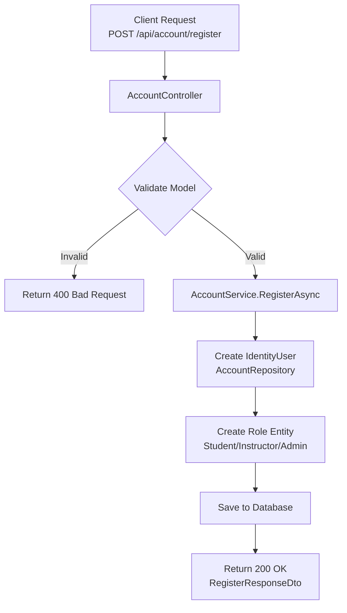
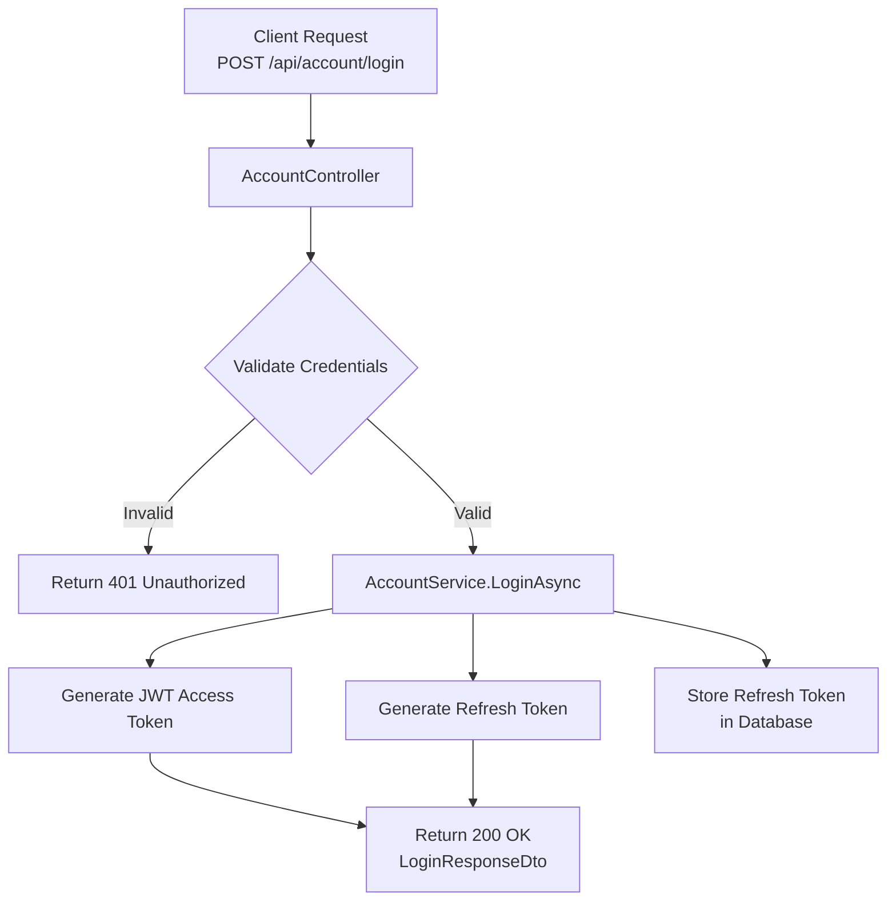
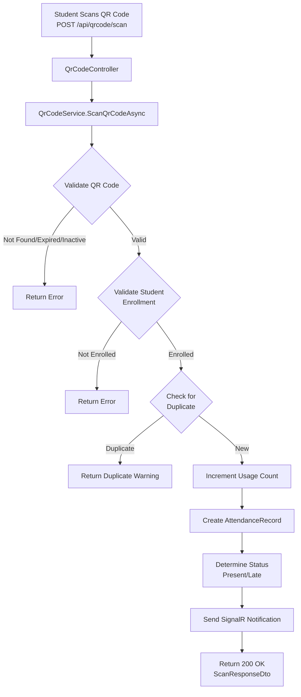
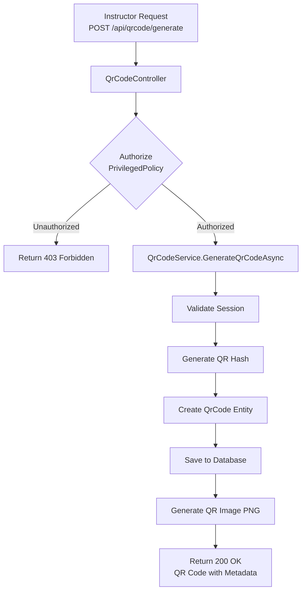
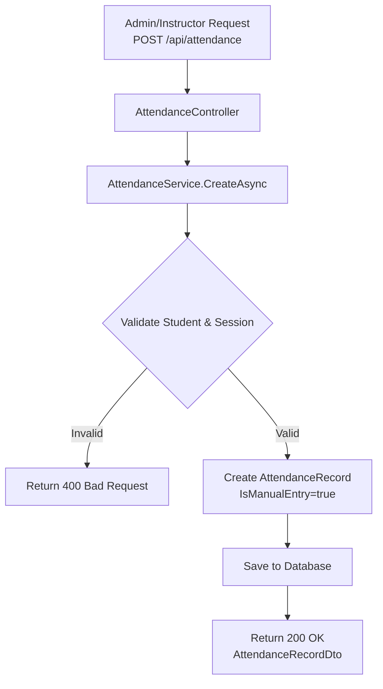
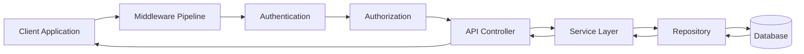

# Attendance Management Backend - Simple Data Flow Chart

## Overview
This document provides a high-level view of the main data flows through the Attendance Management Backend application.

## Architecture Pattern
**Layered Architecture** with Clean Architecture principles
- Presentation Layer (Controllers)
- Business Logic Layer (Services)
- Data Access Layer (Repositories)
- Data Layer (Entity Framework/Database)

---

## Main Data Flows

### 1. User Registration Flow

### 2. Login & Authentication Flow

### 3. Student Attendance via QR Code Scan (Primary Flow)

### 4. QR Code Generation Flow (Instructor/Admin)

### 5. Manual Attendance Recording (Admin/Instructor)

---

## General Request Flow Pattern

---

## Key Entry Points Summary

| Entry Point | Purpose | Flow |
|-------------|---------|------|
| `/api/account/register` | User Registration | Account → AccountService → AccountRepository → DB |
| `/api/account/login` | User Login | Account → AccountService → Token Generation |
| `/api/qrcode/generate` | Generate QR Code | QrCode → QrCodeService → QrCodeRepository → DB |
| `/api/qrcode/scan` | Mark Attendance | QrCode → QrCodeService → AttendanceRepository → DB |
| `/api/attendance` | Manual Attendance | Attendance → AttendanceService → AttendanceRepository → DB |
| `/api/students` | Student Management | Student → StudentService → StudentRepository → DB |

---

## Data Entities

| Entity | Purpose |
|--------|---------|
| **Student** | Student profile information |
| **Instructor** | Instructor/Teacher profile |
| **Admin** | Administrator profile |
| **AttendanceRecord** | Attendance tracking (Present/Late/Absent/Excused) |
| **QrCode** | QR codes for session check-in |
| **Session** | Scheduled class sessions |
| **Schedule** | Recurring schedule patterns |
| **StudentEnrollment** | Student-section-subject relationships |
| **Subject** | Academic subjects |
| **Course** | Courses containing subjects |
| **Section** | Class sections |
| **Classroom** | Physical classroom locations |
